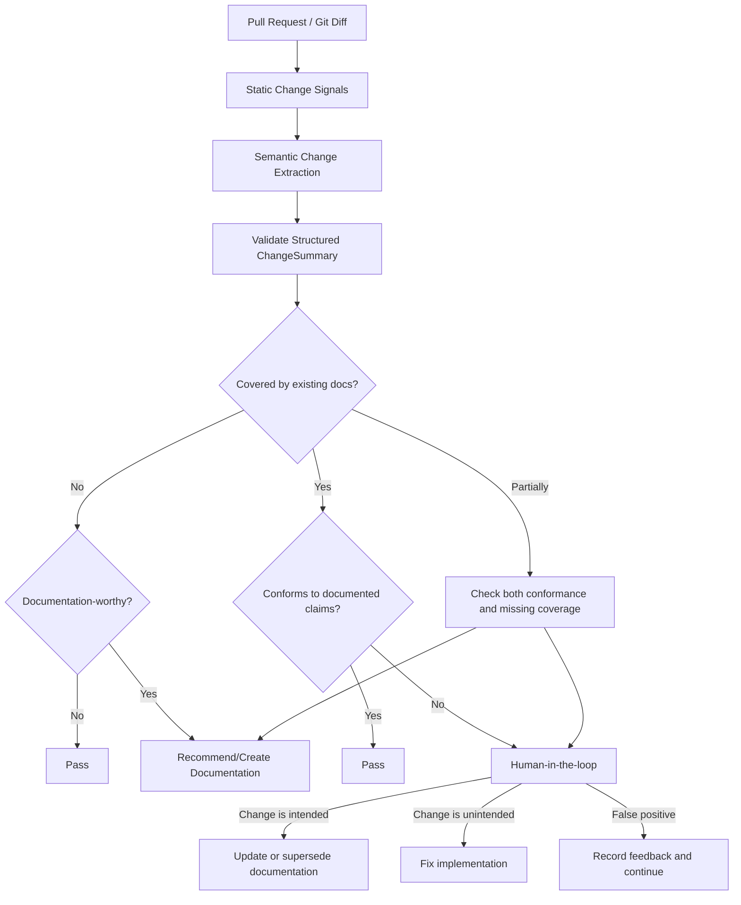

# IntentGuard

**CI for documented intent.**

IntentGuard is a PR-aware documentation integrity agent that keeps source code aligned with architectural decisions, product requirements, technical specifications, API contracts, and operational documentation.

The core idea is simple:

> Every meaningful code change should either conform to existing documented intent, intentionally update that intent, or create new documentation when the change introduces durable knowledge worth preserving.

IntentGuard does **not** treat the LLM as the policy engine. LLMs interpret unstructured changes and documentation; deterministic rules decide what actions are allowed, when human review is required, and whether a PR should pass, warn, or request documentation changes.

## Why this exists

Engineering documentation drifts because code changes continuously while ADRs, PRDs, specs, runbooks, and API documentation are updated manually and inconsistently.

IntentGuard inserts a documentation-consistency gate into the pull-request workflow:

1. Understand the semantic change introduced by the PR.
2. Determine whether that behavior, architecture, or contract is already documented.
3. If documented, verify that the implementation conforms to the relevant claims.
4. If the code conflicts with documented intent, require human resolution.
5. If the change is not documented, determine whether it is significant enough to document.
6. Recommend the minimum required artifact: ADR, spec, PRD, API docs, runbook, README update, etc.

## Core workflow



## Design principles

- **Interpretation is probabilistic; policy is deterministic.**
- **The agent reasons over claims, not entire documents.**
- **Human review resolves intent conflicts.**
- **Explicit abstention is better than fabricated certainty.**
- **False positives are more damaging than missed low-impact documentation changes.**
- **Documentation generation is the final step, not the first.**
- **Every finding must cite evidence from the PR and the governing document.**

## Proposed stack

| Concern | Technology |
|---|---|
| Orchestration | LangGraph |
| LLM/tool abstractions | LangChain, selectively |
| Structured state/contracts | Pydantic |
| Tracing / evals / prompt iteration | Langfuse |
| Git integration | GitHub App / GitHub APIs |
| Retrieval | Deterministic mappings + lexical/entity search + embeddings fallback |
| Policy | Python rule engine / configuration |
| Persistence | PostgreSQL + pgvector initially |
| Async work | Worker queue if indexing becomes expensive |
| API | FastAPI |
| CI integration | GitHub Checks / PR comments |

## Repository map

- [`docs/01-problem-and-goals.md`](docs/01-problem-and-goals.md) — product definition, scope, non-goals
- [`docs/02-system-architecture.md`](docs/02-system-architecture.md) — components and boundaries
- [`docs/03-agent-workflow.md`](docs/03-agent-workflow.md) — LangGraph state machine
- [`docs/04-documentation-model.md`](docs/04-documentation-model.md) — claims, documents, code entities, relationships
- [`docs/05-determinism-and-hitl.md`](docs/05-determinism-and-hitl.md) — deterministic control flow and human review
- [`docs/06-retrieval-and-conformance.md`](docs/06-retrieval-and-conformance.md) — document coverage, retrieval, contradiction checks
- [`docs/07-observability-and-evaluation.md`](docs/07-observability-and-evaluation.md) — Langfuse traces and evaluation framework
- [`docs/08-security-and-trust.md`](docs/08-security-and-trust.md) — permissions, data handling, prompt-injection boundaries
- [`docs/09-deployment.md`](docs/09-deployment.md) — GitHub App and runtime topology
- [`docs/10-roadmap.md`](docs/10-roadmap.md) — MVP to production roadmap
- [`docs/adr/`](docs/adr/) — architecture decisions for IntentGuard itself
- [`examples/`](examples/) — example outputs, policies, and agent state

## North-star outcome

IntentGuard should make this invariant continuously testable:

```text
IMPLEMENTATION  <---->  DOCUMENTED INTENT
```

When those two diverge, the system should not silently decide which side is correct. It should surface the divergence, show the evidence, and ask the responsible human whether the implementation drifted or the decision intentionally changed.
