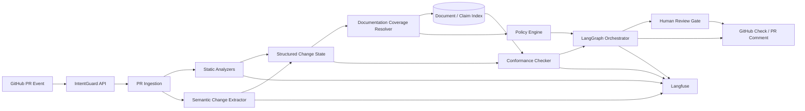
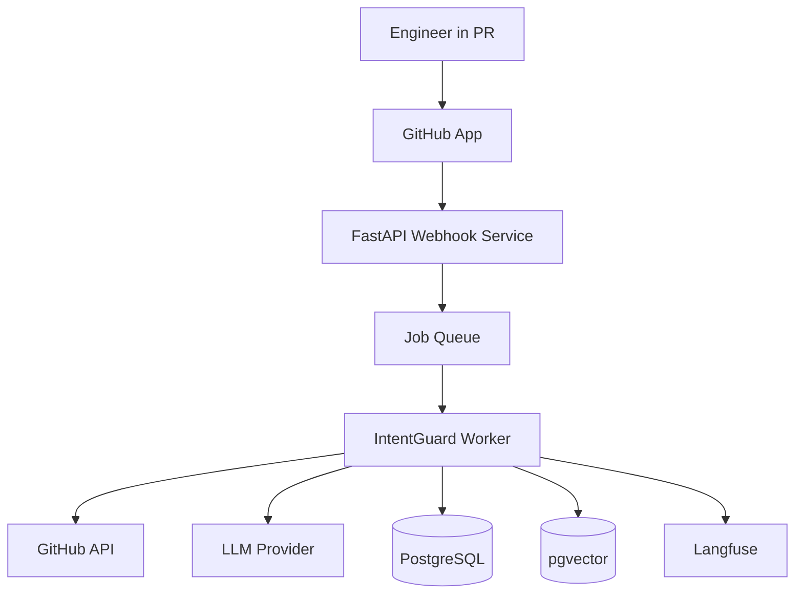

# System Architecture

## High-level architecture



## Component boundaries

### 1. GitHub integration

Responsibilities:

- receive PR webhook events,
- fetch PR metadata and diff,
- fetch repository configuration,
- publish GitHub Check results,
- publish concise PR comments,
- capture human resolution actions.

The GitHub integration should not contain semantic reasoning.

### 2. PR ingestion

Normalizes raw GitHub input into:

- PR metadata,
- changed files,
- hunks,
- commit range,
- repository metadata,
- changed dependencies,
- changed schemas,
- changed infrastructure definitions.

### 3. Static analyzers

Deterministic analyzers extract high-confidence signals before an LLM is used.

Examples:

| Signal | Detection |
|---|---|
| Dependency added | package manifests / lockfiles |
| DB schema changed | SQL migrations / ORM schema |
| API changed | OpenAPI / GraphQL schema diff |
| Infra changed | Terraform / Helm / Kubernetes |
| Config changed | env/config manifests |
| New service call | imports / clients / service map |
| Deployment behavior | Docker / workflow / Helm diff |

### 4. Semantic change extractor

LLM responsibility:

```text
unstructured code + PR context
        ↓
structured semantic facts
```

It should not decide organizational policy.

Example output:

```json
{
  "architecture_changed": true,
  "new_runtime_dependencies": ["redis"],
  "communication_pattern_changed": false,
  "persistence_strategy_changed": true,
  "user_visible_behavior_changed": false,
  "evidence": [
    {
      "path": "catalog/cache.py",
      "start_line": 14,
      "end_line": 42,
      "summary": "Introduces a shared Redis-backed cache"
    }
  ]
}
```

### 5. Documentation index

Stores normalized metadata and extracted claims from:

- ADRs,
- PRDs,
- technical specs,
- API contracts,
- runbooks,
- README files,
- design docs,
- repository conventions.

The index should preserve original text and provenance.

### 6. Coverage resolver

Answers:

> Does any document govern this semantic change?

It combines explicit mappings, ownership/domain metadata, symbol matching, claim/entity matching, and semantic search.

### 7. Conformance checker

Compares **change facts** to **documented claims**.

This is intentionally narrower than comparing whole documents to whole PRs.

### 8. Policy engine

A deterministic policy layer maps structured findings to actions.

Example:

```python
if coverage == "NOT_COVERED" and documentation_worthy:
    action = "CREATE_DOCUMENTATION"

elif coverage == "COVERED" and conformance == "CONFLICTS":
    action = "HUMAN_REVIEW"

elif coverage == "COVERED" and conformance == "CONFORMS":
    action = "PASS"
```

### 9. LangGraph orchestration

LangGraph controls:

- stage ordering,
- branches,
- retries,
- abstention states,
- human interrupts,
- persistence/checkpointing.

It should not be used as an excuse to make routing itself probabilistic when deterministic routing is possible.

### 10. Langfuse

Captures:

- per-node latency,
- prompts and versions,
- model outputs,
- token consumption,
- tool calls,
- rule decisions,
- human overrides,
- evaluation labels,
- false positives,
- regression-test traces.

## Runtime topology



For an MVP, the queue can be skipped and processing can happen synchronously if PR sizes and model latency remain manageable.
