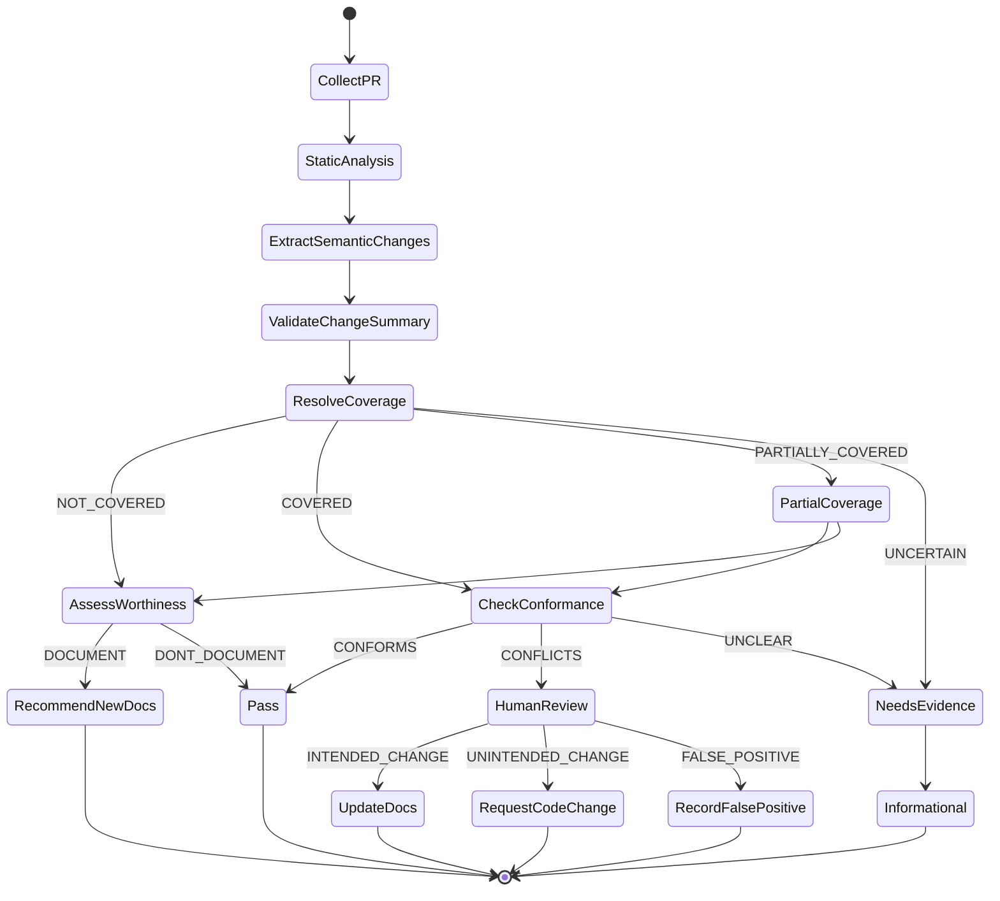
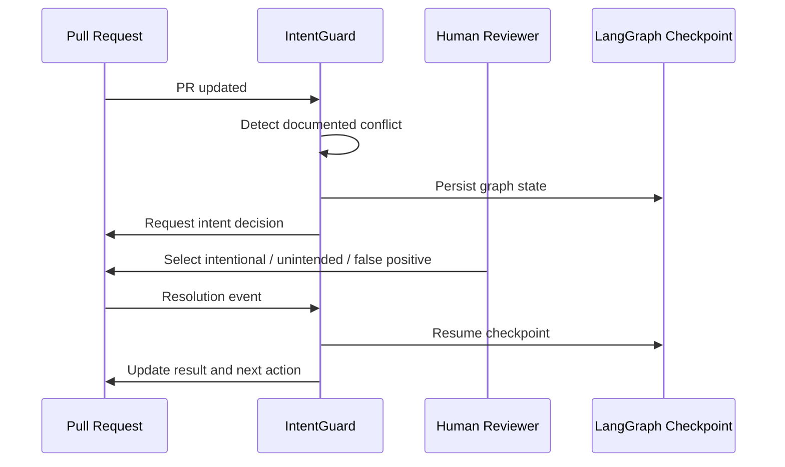

# Agent Workflow

## Why a graph instead of an autonomous loop

IntentGuard should behave more like a compiler pipeline than an open-ended autonomous agent.

Each node has:

- a known input contract,
- a known output contract,
- bounded responsibility,
- explicit routing,
- traceable evidence,
- deterministic failure behavior.

## LangGraph state machine



## Proposed state

```python
from typing import Literal
from pydantic import BaseModel, Field

Coverage = Literal[
    "COVERED",
    "PARTIALLY_COVERED",
    "NOT_COVERED",
    "UNCERTAIN",
]

Conformance = Literal[
    "CONFORMS",
    "CONFLICTS",
    "UNCLEAR",
]

Action = Literal[
    "PASS",
    "CREATE_DOCUMENTATION",
    "UPDATE_DOCUMENTATION",
    "HUMAN_REVIEW",
    "INFORMATIONAL",
]

class Evidence(BaseModel):
    path: str
    start_line: int | None = None
    end_line: int | None = None
    summary: str

class ChangeFact(BaseModel):
    kind: str
    subject: str
    predicate: str
    object: str | None = None
    confidence: float = Field(ge=0, le=1)
    evidence: list[Evidence]

class RelevantDocument(BaseModel):
    document_id: str
    path: str
    relevance_reason: str
    claim_ids: list[str]
    confidence: float = Field(ge=0, le=1)

class AgentState(BaseModel):
    repository: str
    pr_number: int

    facts: list[ChangeFact] = []
    coverage: Coverage | None = None
    relevant_documents: list[RelevantDocument] = []

    conformance: Conformance | None = None
    conflicts: list[dict] = []

    documentation_worthy: bool | None = None
    suggested_artifacts: list[str] = []

    action: Action | None = None
    human_resolution: str | None = None
```

## Node responsibilities

### `collect_pr`

Input: repository, PR number  
Output: normalized PR payload

### `static_analysis`

Deterministically extract machine-readable signals.

### `extract_semantic_changes`

Use an LLM with structured output to infer semantic facts that static analyzers cannot reliably derive.

### `validate_change_summary`

Reject or downgrade unsupported facts.

Rules:

- every important fact requires evidence,
- every file path must exist in the PR,
- confidence must be bounded,
- unsupported enums are rejected,
- model prose is never consumed directly by downstream routing.

### `resolve_coverage`

Determine whether the changed concepts are governed by existing documentation.

### `assess_documentation_worthiness`

Apply deterministic policy to uncovered changes.

### `check_conformance`

Compare change facts to governing claims.

### `human_review`

Interrupt the graph and persist state.

Human options:

- intentional change,
- unintended drift,
- false positive.

### `render_result`

Generate a concise PR comment from already-computed structured findings.

The renderer should not invent new findings.

## Human interrupt pattern


