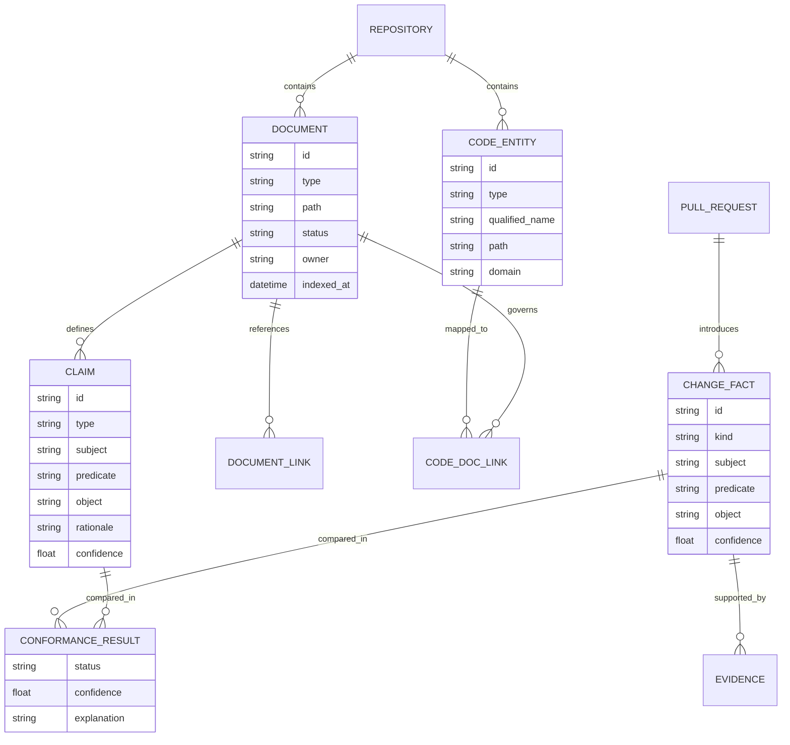

# Documentation Model

## Key design choice: documents are not just text blobs

Whole-document RAG is useful for discovery, but conformance should operate on normalized **claims**.

Example ADR text:

```text
Inventory updates must remain synchronous because checkout requires
acknowledgement before the order can complete.
```

Normalized claim:

```json
{
  "id": "adr-018:c3",
  "type": "architecture_constraint",
  "subject": "inventory_updates",
  "predicate": "must_use",
  "object": "synchronous_communication",
  "rationale": "checkout requires acknowledgement before completion"
}
```

PR fact:

```json
{
  "kind": "communication_pattern_change",
  "subject": "inventory_updates",
  "predicate": "uses",
  "object": "asynchronous_kafka",
  "confidence": 0.96
}
```

Now the system is comparing a fact to a claim, rather than asking an LLM to summarize two large blobs.

## Entity model



## Document types

Initial taxonomy:

- `ADR`
- `PRD`
- `TECH_SPEC`
- `API_SPEC`
- `RUNBOOK`
- `README`
- `SECURITY_DESIGN`
- `MIGRATION_GUIDE`
- `OTHER`

## Claim types

Examples:

- `ARCHITECTURE_DECISION`
- `ARCHITECTURE_CONSTRAINT`
- `PRODUCT_BEHAVIOR`
- `API_CONTRACT`
- `DATA_OWNERSHIP`
- `SECURITY_CONSTRAINT`
- `OPERATIONAL_INVARIANT`
- `DEPLOYMENT_REQUIREMENT`
- `PERFORMANCE_REQUIREMENT`
- `DEVELOPER_WORKFLOW`

## Code-to-document relationships

Useful relation types:

```text
CODE_ENTITY --governed_by--> DOCUMENT
CODE_ENTITY --implements--> CLAIM
DOCUMENT --supersedes--> DOCUMENT
DOCUMENT --references--> DOCUMENT
CLAIM --applies_to--> CODE_ENTITY
CHANGE_FACT --contradicts--> CLAIM
CHANGE_FACT --conforms_to--> CLAIM
```

## ADR lifecycle

ADRs should preserve history.

Preferred states:

```text
PROPOSED
ACCEPTED
DEPRECATED
SUPERSEDED
REJECTED
```

When a new PR intentionally changes an accepted architectural decision, the default recommendation should be to **supersede** the previous ADR rather than silently rewrite historical rationale.
