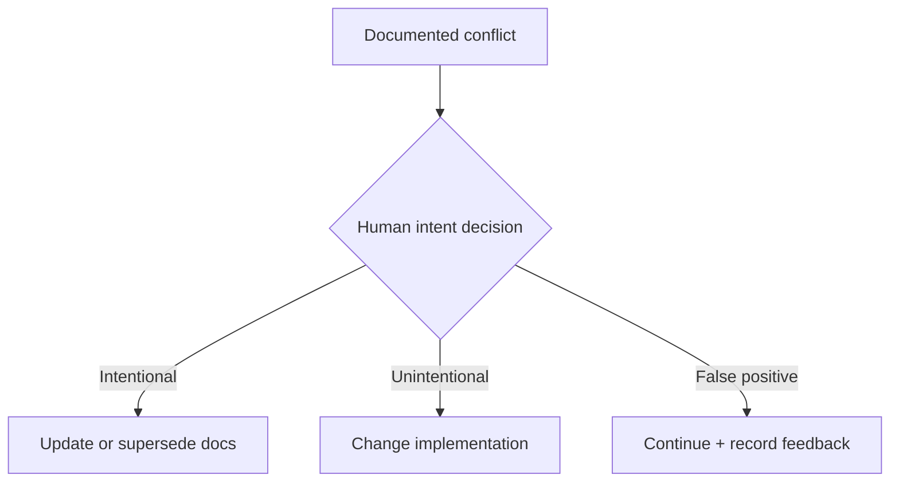

# Determinism and Human-in-the-Loop Design

## Principle

The LLM interprets. Software decides policy.


## Deterministic stages

Prefer deterministic logic for:

- Git diff parsing,
- file classification,
- dependency changes,
- schema diffs,
- API diffs,
- repository/domain mappings,
- policy routing,
- severity,
- blocking behavior,
- human-review requirements,
- confidence thresholds.

## Probabilistic stages

Use an LLM for:

- semantic intent extraction,
- mapping code changes to business/architecture concepts,
- claim extraction during document indexing,
- contradiction/conformance classification where symbolic checks are insufficient,
- concise natural-language explanation.

## Structured outputs

Never route based on arbitrary model prose.

Bad:

```json
{
  "recommendation": "This feels like it probably needs an ADR."
}
```

Preferred:

```json
{
  "architecture_changed": true,
  "new_infrastructure_component": "redis",
  "persistence_strategy_changed": true,
  "evidence": [...]
}
```

Then deterministic policy:

```python
needs_adr = (
    change.architecture_changed
    and (
        change.new_infrastructure_component is not None
        or change.communication_pattern_changed
        or change.persistence_strategy_changed
    )
)
```

## Abstention

Do not force binary answers when evidence is weak.

```text
CONFIRMED
LIKELY
NOT_FOUND
INSUFFICIENT_EVIDENCE
```

Suggested behavior:

| Confidence state | Action |
|---|---|
| Confirmed conflict | Human review |
| Likely conflict | Non-blocking warning |
| Insufficient evidence | Informational or silent |
| Not found | Continue |

## Human review boundary

A conflict is not an error verdict.



This is the correct HITL boundary because intent often cannot be inferred reliably from code.

## Idempotence

For the same:

- commit SHA,
- repository configuration,
- indexed documentation version,
- model/prompt version,

IntentGuard should produce the same policy outcome whenever possible.

Persist:

```text
analysis_key =
hash(
  repo
  + commit_sha
  + docs_index_version
  + policy_version
  + prompt_version
  + model_version
)
```

## Model controls

Recommended:

- low temperature,
- fixed response schema,
- versioned prompts,
- pinned model where practical,
- bounded retry behavior,
- deterministic post-validation,
- explicit confidence calibration.

The model can still produce nondeterministic semantic judgments. The architecture limits how much decision authority those judgments have.
