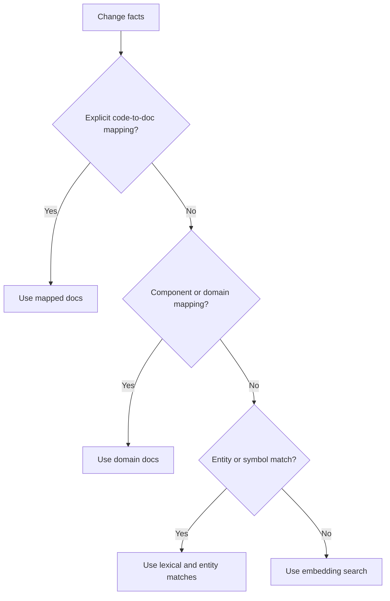

# Retrieval, Coverage, and Alignment

## Coverage is the first semantic decision

The first question is not whether a pull request needs an ADR. The first question is whether the changed behavior, architecture, contract, or operational concept is already governed by existing documentation.

## Retrieval hierarchy

Use the most explicit relationship available before semantic retrieval.



Recommended order:

1. explicit code-to-document links,
2. component/domain ownership mappings,
3. symbol/entity/keyword matching,
4. embeddings,
5. LLM reranking only when needed.

## Example repository configuration

```yaml
components:
  checkout:
    paths:
      - "apps/checkout/**"
      - "libs/cart/**"
    docs:
      - "docs/adr/ADR-014.md"
      - "docs/specs/checkout.md"
      - "docs/prd/checkout-v3.md"

  inventory:
    paths:
      - "services/inventory/**"
    docs:
      - "docs/adr/ADR-018.md"
      - "docs/specs/inventory.md"
```

## Coverage result

```python
class DocumentationCoverage(BaseModel):
    status: Literal[
        "COVERED",
        "PARTIALLY_COVERED",
        "NOT_COVERED",
        "UNCERTAIN",
    ]

    relevant_documents: list[RelevantDocument]
    uncovered_facts: list[str]
    confidence: float
```

## Why partial coverage matters

A PR may reuse a documented technology while introducing a new responsibility.

Example: existing documentation says checkout uses Redis for session caching. A PR then adds Redis-based distributed locking. The technology is already mentioned, but the new responsibility and its tradeoffs are not.

Expected result:

```text
Coverage: PARTIALLY_COVERED
Existing claims: still aligned
New durable decision: distributed locking
Action: update the architecture spec or request an ADR according to policy
```

## Claim-level alignment

After selecting the governing documents, retrieve only statements relevant to the changed subjects.

Example document claims:

```text
ADR-018
  C1: Inventory service owns stock mutation.
  C2: Checkout waits for inventory acknowledgement before completion.
  C3: Inventory updates use synchronous communication.
```

Example PR facts:

```text
F1: Inventory writes are now emitted through Kafka.
F2: Checkout can continue before inventory acknowledgement.
```

The alignment stage evaluates each relevant fact/claim pair and returns one of:

```text
ALIGNED
DIVERGES
UNCLEAR
```

## Structured result

```python
class AlignmentResult(BaseModel):
    fact_id: str
    claim_id: str
    status: Literal["ALIGNED", "DIVERGES", "UNCLEAR"]
    confidence: float
    explanation: str
    fact_evidence: list[Evidence]
    claim_evidence: list[Evidence]
```

The model may classify the relationship and explain the evidence. It does not decide whether the implementation or documentation should win. Policy and, when needed, a human reviewer determine the next action.
