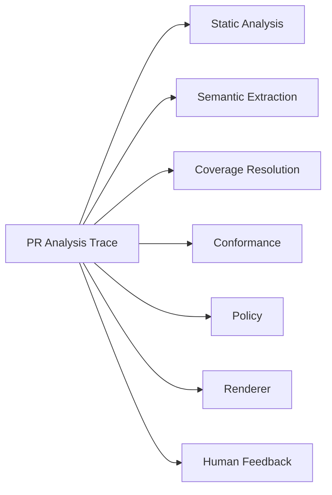
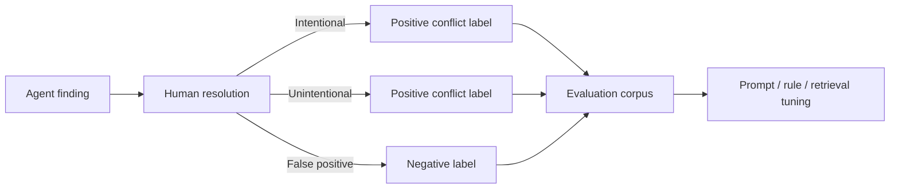

# Observability and Evaluation

## Langfuse role

Every PR analysis should be traceable as one top-level Langfuse trace.



Capture:

- repository / PR / commit identifiers,
- prompt versions,
- model versions,
- latency,
- tokens and cost,
- retrieved documents and claims,
- structured model outputs,
- validation failures,
- rule-engine decisions,
- final action,
- human override,
- false-positive labels.

## Evaluation dataset

Build an offline set from historical PRs.

Each example should contain:

```text
PR diff
PR title/body
relevant docs at the time
expected coverage
expected documentation impact
known conflicts
expected artifact type
human rationale
```

## Primary metrics

### Documentation-impact precision

Of the PRs flagged as requiring documentation, how many truly required it?

```text
precision = TP / (TP + FP)
```

This should be the primary early optimization target.

### Documentation-impact recall

Of the changes that should have triggered documentation work, how many were detected?

### Conflict precision

Of reported code-vs-doc contradictions, how many were genuine?

### Coverage accuracy

How often was `COVERED / PARTIAL / NOT_COVERED` correct?

### Abstention quality

When confidence is low, does the system abstain instead of generating noisy findings?

### Stability

Run the same evaluation multiple times and measure outcome variance.

## Product metrics

- comments per PR,
- percent of comments dismissed as false positives,
- percent resulting in doc updates,
- percent resulting in implementation changes,
- time from PR open to documentation resolution,
- number of stale ADRs/specs discovered,
- acceptance rate of generated doc drafts.

## Regression gates

Before a prompt/model/policy change ships:

```text
conflict precision must not decrease > X%
documentation-impact precision must remain >= target
false-positive rate must remain <= target
stability must remain >= target
```

## Feedback loop

Human outcomes become labeled data:


