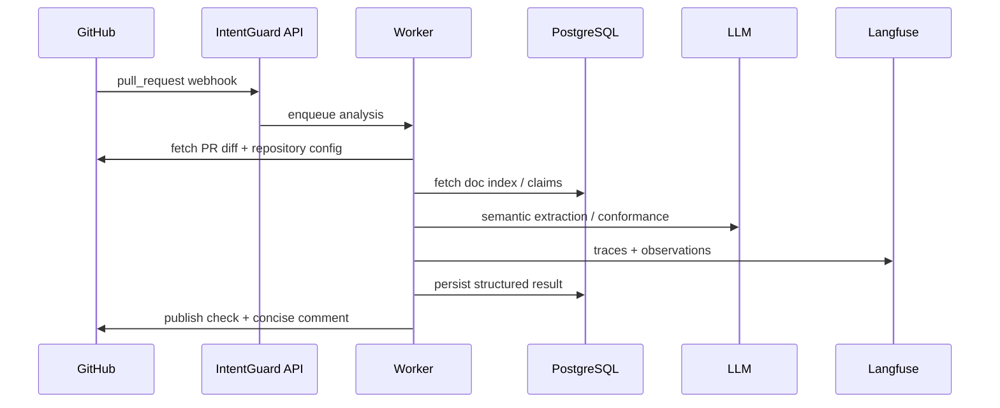

# Deployment and GitHub Integration

## GitHub App flow



## Suggested services

### API service

FastAPI responsibilities:

- webhook verification,
- event normalization,
- human-action callbacks,
- health checks,
- admin endpoints.

### Worker

Runs the LangGraph workflow.

Potential execution choices:

- Celery/RQ/Arq,
- cloud queue + stateless workers,
- synchronous execution for MVP.

### PostgreSQL

Stores:

- repositories,
- doc metadata,
- claims,
- code-doc mappings,
- analyses,
- human feedback,
- policy versions,
- indexing versions.

### pgvector

Use as a fallback semantic retrieval layer.

It should not replace explicit mappings.

### Langfuse

Prefer either:

- cloud with appropriate privacy controls,
- self-hosted for enterprise/private-code deployments.

## Check-run UX

Suggested top-level statuses:

```text
PASS
PASS_WITH_INFO
DOCUMENTATION_UPDATE_RECOMMENDED
HUMAN_REVIEW_REQUIRED
ANALYSIS_FAILED
```

Avoid blocking on:

- low-confidence findings,
- missing optional docs,
- uncertain semantic matches.

Potentially block on:

- confirmed contradiction with an accepted architectural/security constraint,
- organization-configured mandatory API/spec changes.

## PR comment example

```markdown
## IntentGuard — Documentation Integrity

**Human review required**

This PR changes inventory updates from synchronous REST calls to asynchronous Kafka events.

### Governing documentation

`ADR-018 — Inventory communication`

> Inventory updates must remain synchronous because checkout requires acknowledgement before completion.

### Detected divergence

- `services/inventory/publisher.py`: emits stock updates to Kafka
- `checkout/order.py`: no longer waits for inventory acknowledgement

Is this change intentional?

- **Intentional** — supersede/update ADR-018
- **Unintentional** — update implementation
- **False positive** — dismiss and record feedback
```
