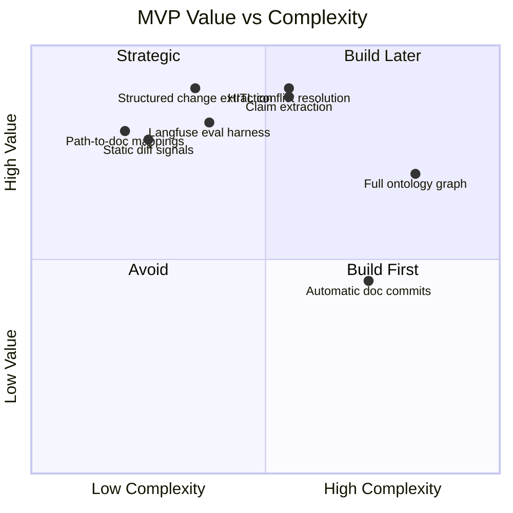

# Roadmap

## Phase 0 — Evaluation harness

Before building the full GitHub experience:

- collect 50–200 historical PRs,
- label documentation-impacting changes,
- identify known ADR/spec conflicts,
- define baseline precision/recall,
- create Langfuse datasets.

Deliverable: reproducible offline evaluation.

## Phase 1 — MVP

Scope:

- GitHub PR ingestion,
- Markdown documentation only,
- ADR + tech spec support,
- static signals,
- semantic `ChangeSummary`,
- simple repository path-to-doc mapping,
- structured coverage classification,
- conformance checks,
- PR comment output,
- Langfuse tracing.

Do **not** automatically modify docs.

## Phase 2 — Deterministic policy engine

Add:

- configurable rules,
- API/schema diffing,
- dependency/infrastructure analysis,
- confidence thresholds,
- abstention,
- severity and blocking policy,
- policy versioning.

## Phase 3 — Claim index

Add:

- offline claim extraction,
- document lifecycle/status,
- document-to-code links,
- entity normalization,
- claim-level retrieval,
- supersession graph for ADRs.

## Phase 4 — Human-in-the-loop

Add:

- persistent LangGraph checkpoints,
- GitHub action buttons or commands,
- intended/unintended/false-positive resolution,
- feedback dataset ingestion.

## Phase 5 — Documentation proposal engine

After intent is resolved:

- propose ADR,
- update spec sections,
- supersede ADR,
- produce documentation branch/PR,
- never merge autonomously by default.

## Phase 6 — Multi-repository architecture graph

Support:

- service-to-service relationships,
- centrally stored architecture docs,
- shared ADRs,
- cross-repository conformance,
- organization-level policies.

## Phase 7 — Continuous documentation health

Beyond PRs:

- scheduled drift analysis,
- stale-document detection,
- docs with no implementation references,
- code paths with no governing documentation,
- architecture-decision coverage dashboard.

## MVP prioritization

